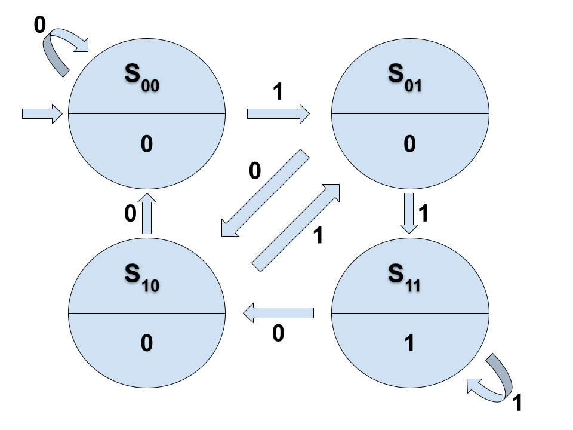

# Moorovi avtomati

Projekt vsebuje implementacijo Moorovih avtomatov pri analiziranju dvojiških nizov z logičnimi operacijami. 

## Opis

Moorov avtomat je končni avtomat z izhodom, odvisnim od trenutnega stanja. Vhodni podatki ne vplivajo neposredno na izhod, temveč na prehode med stanji. Moorovi avtomati se imenujejo po ameriškem matematiku in računalničarju, ki je koncept opisal leta 1956. 

## Formalna definicija

Formalno je Moorov avtomat definiran kot nabor s šestimi elementi $(S, s_0, \Sigma, O, \delta, G)$, kjer so:

- $S$ končna množica stanj,
- $s_0 \in S$ začetno stanje,
- $\Sigma$ končna množica oz. abeceda vhodov,
- $O$ končna množica oz. abeceda izhodov,
- $\delta : S \times \Sigma \to Q$ prehodna funkcija,
- $G : S \to O$ izhodna funkcija.

## Primer implementacije

Naš primer Moorovega avtomata analizira nize iz ničel in enic. Vmesnik od uporabnika sprejema po en simbol, ki je bodisi "0", ki predstavlja neresnico (false) ali "1", ki predstavlja resnico (true). Glede na zadnja dva sprejeta simbola se avtomat premika med štirimi možnimi stanji. Če sta zadnja dva sprejeta simbola $i, j$ se bo avtomat nahajal v stanju $s_{ij}$. Izhodna funkcija izvede logično operacijo na nizu ničel in enic dolžine 2. Privzeta operacija je konjukcija oz. logični "in", uporabnik pa lahko operacijo tudi spreminja, kar vpliva na izhodno funkcijo. Tudi izhod je podan z ničlo ali enico.

- $S = ${$s_{00}$, $s_{10}$, $s_{01}$, $s_{11}$},
- $s_0 = s_{00}$,
- $\Sigma$ = {0, 1},
- $O$ = {0, 1},
- $\delta : S \times \Sigma \to S$ je podana s tabelo:

    | $\delta$ | `0`    | `1`   | 
    | -------- | -----  | ----- | 
    | $s_{00}$   | $s_{00}$ | $s_{01}$ | 
    | $s_{10}$   | $s_{00}$ | $s_{01}$ | 
    | $s_{01}$   | $s_{10}$ | $s_{11}$ | 
    | $s_{11}$   | $s_{10}$ | $s_{11}$ | 

- Funkcijo $G$ določa resničnostna tabela izbrane logične operacije. Stanje s_{10} funkcija na primer interpretira kot nabor $(1, 0)$ oz. $(true, false)$, na teh dveh logičnih vrednostih pa izvede trenutno izbrano logično operacijo. Za operacijo "in" je tabela funkcije G sledeča:

    | stanje |  $G$  |
    | -------| ----- |
    | $s_{00}$ | $0$ | 
    | $s_{10}$ | $0$ | 
    | $s_{01}$ | $0$ | 
    | $s_{11}$ | $1$ | 

Diagram Moorovega avtomata pri izbrani logični operaciji "in". Krogi označujejo stanja (zgoraj je stanje, spodaj pa pripadajoči izhod), puščice pa prehode med stanji:

## Navodila za uporabo

Avtomat uporabljamo s pomočjo ukazov, ki jih vpisujemo v terminal. Tekstovni vmesnik prevedemo z ukazom `dune build`, ki ustvari datoteko `tekstovniVmesnik.exe`. Ukaz `./tekstovniVmesnik.exe` datoteko požene. Med izvajanjem programa sledimo navodilom v terminalu. Na vsakem koraku izvajanja imamo pet možnosti:
- izpis avtomata: izpiše avtomat z vsemi možnimi stanji in pripadajočimi izhodi, kjer je trenutno stanje označeno s `->`,
- branje znakov: prebere po en znak, ki mora biti "0" ali "1",
- ponastavitev avtomata v začetno stanje: ponastavi na stanje $s_{00}$,
- prikaz trenutnega stanja: prikaže stanje in pripadajoči izhod,
- izbira binarne logične operacije: omogoča izbiro ene od petih operacij.

Z vpisom pripadajoče številke izberemo ukaz, ki ga želimo izvesti. Glede na izbiro nato sledimo navodilom vmesnika.

## Struktura datotek

Projekt je sestavljen iz map `src` in `definicije`, ki vsebujeta naslednje datoteke:
- `avtomat.ml`: definira strukturo Moorovega avtomata,
- `stanje.ml`: definira tip stanja,
- `tekstovniVmesnik.ml`: vmesnik za analizo dvojiških nizov s pomočjo terminala.

## Viri
- https://en.wikipedia.org/wiki/Moore_machine
- https://www.sciencedirect.com/topics/computer-science/moore-machine
- https://github.com/matijapretnar/programiranje-1/tree/master/projekt

